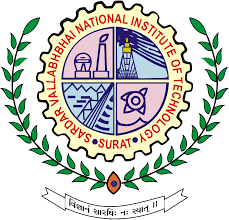

## Hi there 👋

<h3 align="center">"Programming is the art of telling another human being what one wants the computer to do."</h3>
<h4 align="center">- Donald Ervin Knuth -</h4>

 

##  About Me
👋 Hello! I’m <b>Yashoda Neupane.</b>
As a dedicated Software Engineer with 7+ years of experience in full-stack development, I specialize in <b>Java, Spring Boot,Microservices, and RESTful APIs</b>, along with expertise in <b>Python, C#, .NET, Angular</b>  My goal is to apply my diverse IT experience to design scalable, maintainable software solutions that solve real-world challenges.
Throughout my career, I’ve built secure and scalable web and mobile applications for finance sector , optimized workflow automation, and managed robust data systems. I thrive on learning new technologies and contributing to high-impact projects.
Let’s connect and collaborate on something amazing! 🚀

 

## Language and Tools

#### Main Stack:

  
  
  
  
  
  
   
  
  
  
  
   
   

 

## 🎓 Academic Background

  
  

    <strong>Information Technology Solutions</strong> 
    <a href="https://humber.ca/">Humber College</a> • Oct 2024 - Mar 2025 
    📍 Toronto, Canada
  

 
 

  
  

    <strong>Bachelor of Technology (Electronics and Communication Engineering)</strong> 
    <a href="https://www.svnit.ac.in/">Sardar Vallabhbhai National Institute of Technology </a>  
    📍 Surat, India
  

 

## 💼 Professional Experience

### 🔹 **Senior Software Engineer**  
  ➤ **Beetech Solution Pvt Ltd**  
  📅 September 2022 - May 2024  
  📍 Remote/On-site  

### 🔹 **Senior Software Engineer**  
  ➤ **Capgemini HK Ltd**  
  📅 April 2021 - July 2022  
  📍 Hong Kong  

### 🔹 **Software Engineer**  
  ➤ **Capgemini HK Ltd**  
  📅 April 2017 - July 2019  
  📍 Hong Kong  

### 📱 **Mobile Application Developer**  
  ➤ **Pactera HK Ltd**  
  📅 May 2015 - June 2016  
  📍 Hong Kong  

### 🔸 **Associate Software Engineer**  
  ➤ **Kony IT Services Ltd (now Temenos)**  
  📅 July 2013 - January 2015  
  📍 [Hyderabad, India]  

 

## 🌐 Contact Me : 

  
 yashoda.neupane2024@gmail.com

  
  [Yashoda Neupane] (https://www.linkedin.com/in/yashoda-neupane/)

